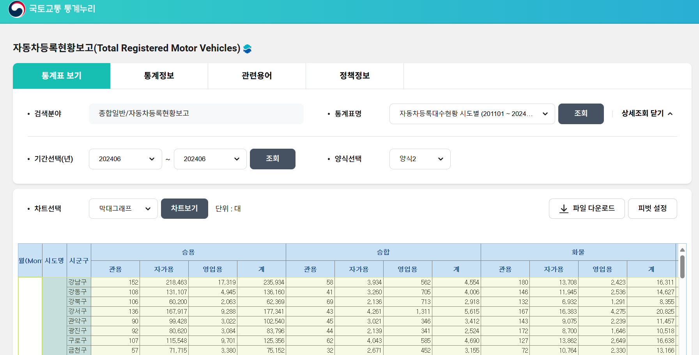
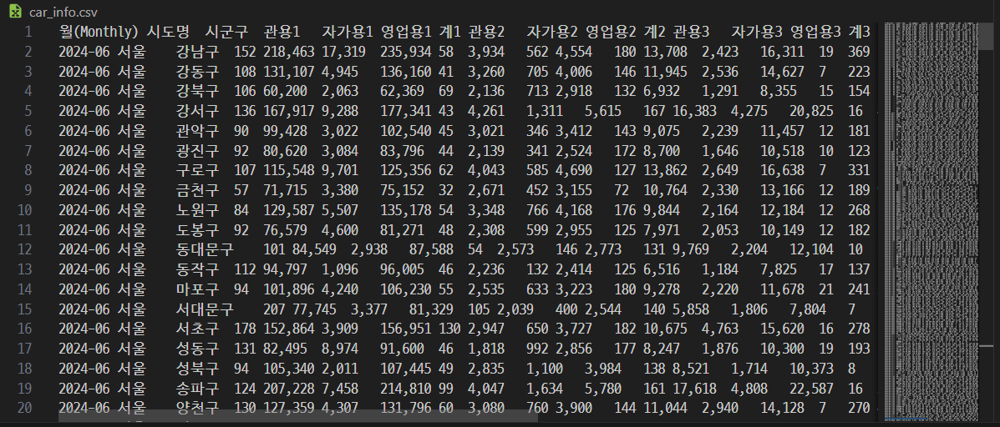

전국 자동차 현황을 보고 싶어 검색을 했다.
이 중에서, 국토교통 통계누리에서 자동차 등록 현황 보고을 참고하였다.
URL  : https://stat.molit.go.kr/portal/cate/statView.do?hRsId=58&hFormId=5498&hSelectId=5409&hPoint=&hAppr=1&hDivEng=&oFileName=&rFileName=&midpath=&sFormId=5498&sStart=202401&sEnd=202401&sStyleNum=2&settingRadio=xlsx

자료를 excel / csv / text 형태로 다운로드 할수 있도록 서비스 해 주었음.
그 중에서 Text 형태로 다운로드 받았음.
( * csv로 다운 받으면, ','를 seperator로 사용하는데, 자료에 숫자가 1000 단위를 넘어 가면 ','로 자리수를 보여 주어, seperator로 작동 되는 문제가 있었음.)

Download 받은 자료가 승용, 승합 , 화물, 특수 로 구분 되어 있고, 그 밑에 다시 관용 , 자가용, 영업용 , 계 로 구분 되어 있어, culumn 을 정리 할 필요가 있었다.

이에 승용 : 1, 승합 : 2, 화물 : 3 , 특수 : 4 로 지정하고, column 이름을  관용1, 자가용1, 영업용1, 계1 등으로 작성하여, 중복을 피하면서 1줄로 Column을 작성 하였다.

import pandas as pd
df = pd.read_csv("car_info.csv", delimiter='\t')

읽어 온 결과.

자료 업로드
기존의 자료를 DataFrame으로 읽어 mySQL에 저장 한다.

for i in range(len(df)):
    city = df["시도명"][i]
    gun_gu = df["시군구"][i]

    for j in range(4):
        usages = j
        offical_car = int(df[f"관용{j}"][i].replace(",",""))
        own_car = int(df[f"자가용{j}"][i].replace(",",""))
        commercial = int(df[f"영업용{j}"][i].replace(",",""))
        total = int(df[f"계{j}"][i].replace(",",""))
        sql = "INSERT INTO car_data (city, gun_gu, usages,offical_car, own_car,commercial,  total) VALUES (\"%s\", \"%s\", %d, %d, %d, %d, %d);" % (city, gun_gu, usages,offical_car, own_car,commercial,  total)

        cur.execute(sql)

cur.execute("commit;")

* 자료에 ','가 들어 있어, 이를 Null로 바꾸어야지만 숫자로 변환 됨을 유의 해야 함.
그래서 모든 자료에서 ','를 Null로 Replace 함.

mySQL에 올라간 자료

